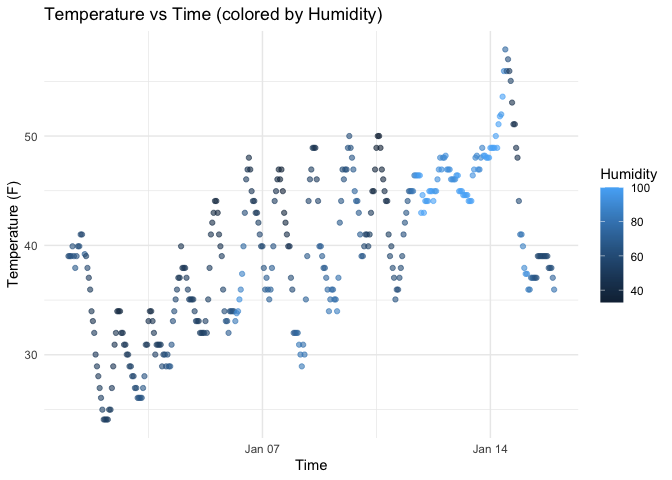

P8105_hw1_ht2717
================
Haoyi Tan

## Problem 1

``` r
library(tidyverse)
```

    ## ── Attaching core tidyverse packages ──────────────────────── tidyverse 2.0.0 ──
    ## ✔ dplyr     1.1.4     ✔ readr     2.1.5
    ## ✔ forcats   1.0.0     ✔ stringr   1.5.1
    ## ✔ ggplot2   3.5.2     ✔ tibble    3.3.0
    ## ✔ lubridate 1.9.4     ✔ tidyr     1.3.1
    ## ✔ purrr     1.1.0     
    ## ── Conflicts ────────────────────────────────────────── tidyverse_conflicts() ──
    ## ✖ dplyr::filter() masks stats::filter()
    ## ✖ dplyr::lag()    masks stats::lag()
    ## ℹ Use the conflicted package (<http://conflicted.r-lib.org/>) to force all conflicts to become errors

``` r
library(moderndive)
data("early_january_weather")
```

## Description of dataset

The `early_january_weather` dataset contains 358 rows and 15 columns of
hourly weather data recorded at New York City airports (EWR, JFK, and
LGA).

- `origin`: weather station / airport code (EWR = Newark, JFK = John F.
  Kennedy, LGA = LaGuardia).  
- `time_hour`: POSIXct timestamp for each hourly observation.  
- `temp`: air temperature in °F (mean = 39.58).  
- `dewp`: dew point temperature in °F.  
- `humid`: relative humidity (0–1).  
- `wind_dir`: wind direction in degrees (0–360).  
- `wind_speed`: average wind speed in miles per hour.  
- `wind_gust`: maximum wind gust (mph).  
- `precip`: hourly precipitation in inches.  
- `pressure`: sea-level pressure in millibars.  
- `visib`: visibility in miles.

This dataset provides a detailed view of weather conditions, including
temperature, humidity, wind, precipitation, and air pressure, making it
suitable for analyzing short-term weather patterns in NYC.

``` r
ggplot(early_january_weather, aes(x = time_hour, y = temp, color = humid)) +
  geom_point(alpha = 0.6) +
  labs(
    title = "Temperature vs Time (colored by Humidity)",
    x = "Time",
    y = "Temperature (F)",
    color = "Humidity"
  ) +
  theme_minimal()
```

<!-- -->

### Patterns observed

Temperatures fluctuate in a clear **diurnal cycle** (daily pattern),
with lower values during nighttime and higher values during daytime.
Over the first two weeks of January, there is an overall **increase in
temperature**, followed by a brief drop near the end of the observation
window.

Points with **higher humidity** (darker colors) are often associated
with **lower to moderate temperatures**, while **warmer hours** tend to
coincide with **lower humidity**. There is also noticeable **day-to-day
variability**, but the general relationship between temperature, time,
and humidity is consistent across the period.

``` r
ggsave("scatter_temp_time.png", width = 7, height = 4)
```

## Problem 2

We will create a dataframe with four types of variables:

1.  A random sample of size 10 from a standard Normal distribution  
2.  A logical vector indicating whether elements of the sample are
    greater than 0  
3.  A character vector of length 10  
4.  A factor vector of length 10, with 3 different levels

## Create a dataframe

``` r
set.seed(123)  # make results reproducible

df <- tibble(
  norm_sample = rnorm(10),
  is_positive = rnorm(10) > 0,
  char_vec = sample(letters[1:3], 10, replace = TRUE),
  factor_vec = factor(sample(c("low", "medium", "high"), 10, replace = TRUE))
)

df
```

    ## # A tibble: 10 × 4
    ##    norm_sample is_positive char_vec factor_vec
    ##          <dbl> <lgl>       <chr>    <fct>     
    ##  1     -0.560  TRUE        c        high      
    ##  2     -0.230  TRUE        b        low       
    ##  3      1.56   TRUE        a        high      
    ##  4      0.0705 TRUE        c        medium    
    ##  5      0.129  FALSE       a        low       
    ##  6      1.72   TRUE        a        medium    
    ##  7      0.461  TRUE        b        low       
    ##  8     -1.27   FALSE       c        low       
    ##  9     -0.687  TRUE        c        high      
    ## 10     -0.446  FALSE       a        low

\#Compute means:

``` r
mean(df$norm_sample)      # works: numeric
```

    ## [1] 0.07462564

``` r
mean(df$is_positive)      # works: TRUE=1, FALSE=0
```

    ## [1] 0.7

``` r
mean(df$char_vec)         # error: characters can’t be averaged
```

    ## Warning in mean.default(df$char_vec): argument is not numeric or logical:
    ## returning NA

    ## [1] NA

``` r
mean(df$factor_vec)       # error: factors can’t be directly averaged
```

    ## Warning in mean.default(df$factor_vec): argument is not numeric or logical:
    ## returning NA

    ## [1] NA

The mean of numeric data works as expected.

The mean of a logical vector works because R treats TRUE as 1 and FALSE
as 0.

Character and factor variables cannot be directly averaged.

``` r
as.numeric(df$is_positive)
```

    ##  [1] 1 1 1 1 0 1 1 0 1 0

``` r
as.numeric(df$char_vec)
```

    ## Warning: NAs introduced by coercion

    ##  [1] NA NA NA NA NA NA NA NA NA NA

``` r
as.numeric(df$factor_vec)
```

    ##  [1] 1 2 1 3 2 3 2 2 1 2

Logical → numeric: TRUE becomes 1, FALSE becomes 0.

Character → numeric: produces NA with a warning, because letters can’t
be coerced into numbers.

Factor → numeric: returns the underlying integer codes for factor levels
(e.g., 1 = “high”, 2 = “low”, 3 = “medium”).

This explains why taking the mean works for numeric and logical
variables, but not for characters or factors.
